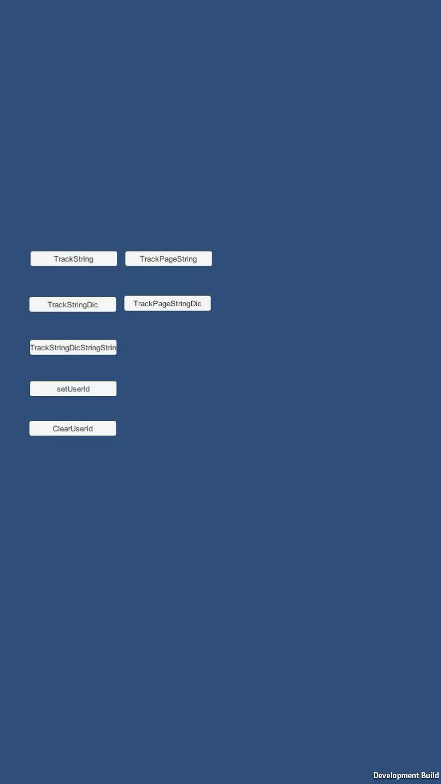
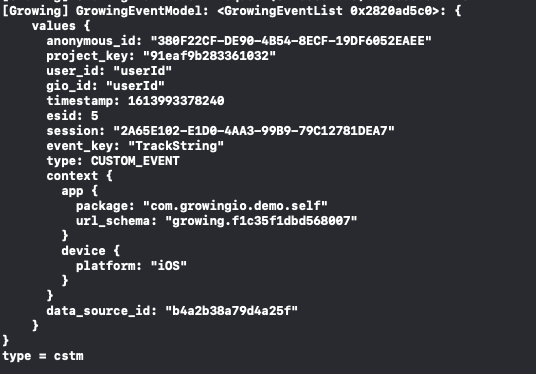
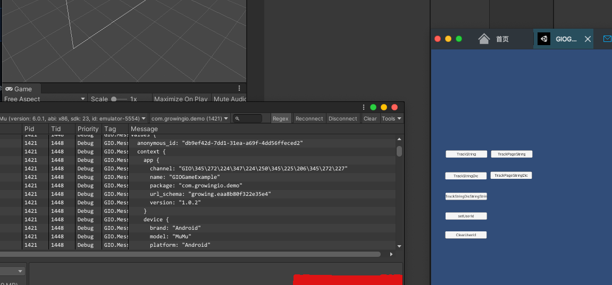

### growing-unity-demo

* GrowingIO Unity平台埋点SDK集成Demo(基于Unity2019.4)

#### API列表

* Track: 发送自定义事件, 对应于cstm事件

  ```C#
  public static void Track(string eventName)
  public static void Track(string eventName, Dictionary<string, object> var)
  public static void Track(string eventName, Dictionary<string, object> var, String itemId, String itemKey)
  ```

* TrackPage: 发送自定义Page事件, 对应于page事件

  ```C#
  public static void TrackPage(string pageName)
  public static void TrackPage(string pageName, Dictionary<string, object> var)
  ```

* SetUserId: 设置登录用户ID

  ```c#
  public static void SetUserId(string userId)
  ```

* ClearUserId: 清除登录用户ID

  ```C#
  public static void ClearUserId()
  ```

#### 集成步骤

* Android

  * 将最新版本的vds-android-agent-cdp以及对应依赖的protobuf-lite、gmonitor替换Assets/Plugins/Android目录下对应文件
  * 将Assets/Plugins/Android 下内容以及Assets/Sources 内容拷贝到对应工程目录下
  * 在Assets/Plugins/Android/AndroidManifest.xml中配置对应项目的url scheme
  * 在Assets/Sources/com/growingio/demo/App.java中配置对应启动配置
  * 将Scripts/GrowingIO放入对应工程
  * 更多细节参考[Android原生端埋点sdk](https://docs.growingio.com/op/developer-manual/sdkintegrated/cdp/android-sdk)
  * Edit/Project Settings/Player/Other Settings 中配置包名

* iOS

  * 将最新版本的GrowingCDPCoreKit.framework和Growing.h替换Assets/Plugins/iOS目录下对应文件

  * 将Assets/Plugins/iOS/GrowingIOHelper.mm 放入对应工程目录

  * 将Scripts/GrowingIO放入对应工程

  * 将Editor/BuildPostProcessor.cs放入对应工程目录(目前依赖framework支持直接勾选, 如果希望通过勾选配置以及手动配置scheme, 请参考原生sdk文档)

  * 在导出的Xcode工程中UnityAppController.mm文件中添加如下代码完成初始化

    ```objc
    #import <WebKit/WebKit.h>
    #import "Growing.h"
    
    - (BOOL)application:(UIApplication*)application didFinishLaunchingWithOptions:(NSDictionary*)launchOptions
    {
      	...
        [Growing startWithAccountId:@"AccountId" dataSourceId:@"dataSourceId"];
        [Growing setTrackerHost:@"host"];
        [Growing setEnableLog:YES];
    }
    ```

  * 更多细节参考[iOS原生端埋点sdk](https://docs.growingio.com/op/developer-manual/sdkintegrated/cdp/ios-sdk)
  * Edit/Project Settings/Player/Other Settings 中配置Bundle Identifier

#### 集成效果

* iOS





* Android

